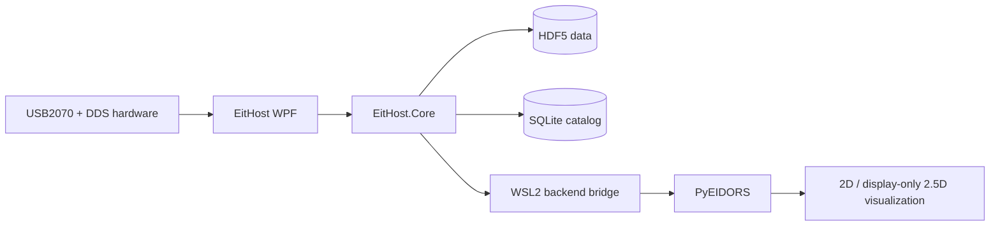

# EitHost

<p align="center">
  <strong>Windows workstation for multi-set Electrical Impedance Tomography acquisition, data management, and real-time reconstruction.</strong>
</p>

<p align="center">
  <a href="https://github.com/CBZ199671/EitHost"></a>
  <a href="https://dotnet.microsoft.com/"></a>
  <a href="https://github.com/CBZ199671/EitHost/blob/main/LICENSE"></a>
  <a href="https://github.com/CBZ199671/PyEIDORS"></a>
</p>

EitHost 是面向多套电阻抗成像（EIT）设备的 Windows 桌面上位机。它负责 USB2070 数据采集、DDS 激励控制、设备配对、HDF5/SQLite 数据管理、实时解调与质量诊断，并通过 WSL2 对接 [PyEIDORS](https://github.com/CBZ199671/PyEIDORS) 完成重构和可视化。

> **项目定位：** EitHost 是科研与工程实验软件，并非医疗器械。硬件控制、同步精度和重构结果应在目标设备与实验条件下独立验证。

## 主要能力

- **多套设备编排：** 每套设备由一块 USB2070 采集卡和一块 DDS 串口控制板组成，支持手动配对、单套控制与多套同步启动。
- **实时采集与解调：** 采集、解调、诊断、重构和界面渲染采用解耦流水线，降低慢任务对采集节拍的影响。
- **数据可追溯：** 原始数据和派生结果使用 HDF5，实验目录与处理状态使用 SQLite catalog 管理，并支持 CSV 导出与数据库回放。
- **PyEIDORS 后端：** 通过可配置的 WSL2 持久工作进程调用 PyEIDORS；求解器路线由后端 manifest/profile 声明，不在 GUI 中硬编码。
- **可视化与分析：** 支持实时边界电压、重构图像、固定 ROI 时序分析，以及由两层独立二维重构插值得到的显示型 2.5D 视图。
- **现场运维：** 提供设备扫描、驱动预检、运行日志、证据导出和中英文界面。
- **开箱运行：** 仓库包含 Windows x64 自包含发布版，无需另行安装 .NET Runtime。

## 系统架构



EitHost 负责 Windows 侧硬件、实验流程与数据生命周期；PyEIDORS 负责有限元正问题和逆问题求解。两者通过明确的后端配置与数据协议连接，便于独立演进。

## 快速开始

### 直接运行 Windows x64 发布版

1. 从硬件厂商提供的安装包安装 USB2070 Windows 驱动。
2. 克隆或下载本仓库。
3. 完整保留 `release/EitHost-Windows-x64` 目录，然后运行：

```powershell
.\release\EitHost-Windows-x64\EitHost.App.exe
```

不要只复制单个 `.exe`。程序需要同目录中的配置和运行库。仓库提供 GUI 所需的 x64 `USB2070.dll`，但不包含 USB2070 内核驱动安装包。

发布文件的使用方法与 SHA-256 校验说明见 [`release/EitHost-Windows-x64/README.md`](release/EitHost-Windows-x64/README.md)。

### 从源码构建

源码构建需要 Windows 10/11 x64 和 [.NET 10 SDK](https://dotnet.microsoft.com/download/dotnet/10.0)。

```powershell
git clone https://github.com/CBZ199671/EitHost.git
cd EitHost
dotnet restore .\EitHost.slnx
dotnet build .\EitHost.slnx --configuration Release
dotnet run --project .\src\EitHost.App\EitHost.App.csproj --configuration Release
```

## 配置 PyEIDORS 后端

实时重构是可选功能，需要 WSL2 和可工作的 PyEIDORS 后端。复制示例配置：

```powershell
Copy-Item `
  .\src\EitHost.App\eithost.reconstruction.example.json `
  .\src\EitHost.App\eithost.reconstruction.json
```

然后根据本机环境设置 `DistroName`、`BackendRepositoryPath` 和可选 `BackendProfile`。后端安装、profile 和 worker 接口以 [PyEIDORS 仓库](https://github.com/CBZ199671/PyEIDORS)为准。

## 仓库结构

| 路径 | 内容 |
|---|---|
| `src/EitHost.App` | .NET 10 / WPF 桌面应用、工作区 ViewModel 与实时可视化 |
| `src/EitHost.Core` | 采集、硬件协议、解调、诊断、存储、同步与重构桥接 |
| `scripts` | USB2070 驱动安装与管理员启动辅助脚本 |
| `release/EitHost-Windows-x64` | 可直接运行的 Windows x64 自包含发布版与校验值 |

## Affiliation, Laboratory, and Funding

| Item | Details |
|---|---|
| Laboratory | 455 Lab |
| Location | Beijing, China |
| Affiliation | College of Information and Electrical Engineering, China Agricultural University |
| Lab Head | Prof. Lan Huang, Prof. Zhong-Yi Wang, and Dr. Lifeng Fan |

455 Lab focuses on plant electrophysiological phenotyping, crop root phenotyping, and crop water-status monitoring. EitHost and PyEIDORS support real-time, in-situ, non-destructive EIT experiments in this research context.

This work was supported by the National Natural Science Foundation of China (Grant No. 62271488).

## License

EitHost 原创源码采用 [MIT License](LICENSE)。仓库中的厂商运行库、自包含 .NET 组件和 NuGet 依赖保留各自的许可条款，不因本仓库采用 MIT 而被重新授权；详见 [THIRD_PARTY_NOTICES.md](THIRD_PARTY_NOTICES.md)。
