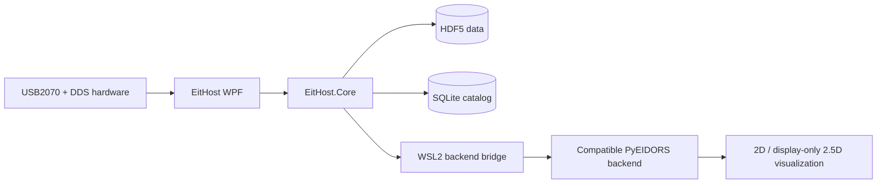

# EitHost

<p align="right">
  <strong>English</strong> | <a href="README.zh-CN.md">简体中文</a>
</p>

<p align="center">
  <strong>Windows workstation for multi-set Electrical Impedance Tomography acquisition, data management, and real-time reconstruction.</strong>
</p>

<p align="center">
  <a href="https://github.com/CBZ199671/EitHost"></a>
  <a href="https://dotnet.microsoft.com/"></a>
  <a href="https://github.com/CBZ199671/EitHost/blob/main/LICENSE"></a>
  <a href="https://github.com/CBZ199671/PyEIDORS"></a>
</p>

EitHost is a Windows desktop application for multi-set Electrical Impedance Tomography (EIT) systems. It coordinates USB2070 data acquisition, DDS excitation, device pairing, HDF5/SQLite data management, real-time demodulation, and signal-quality diagnostics. When a compatible backend is available, EitHost connects to PyEIDORS through WSL2 for reconstruction and visualization.

> **Project scope:** EitHost is research and engineering software, not a medical device. Hardware control, synchronization accuracy, and reconstruction results must be independently validated on the target equipment and under the intended experimental conditions.

> **Backend release status:** EitHost currently integrates with the unreleased PyEIDORS v2 backend used by our laboratory. We are committed to open-sourcing PyEIDORS v2 after the associated manuscript has been completed. The current public [PyEIDORS repository](https://github.com/CBZ199671/PyEIDORS) represents an earlier public generation and does not include the worker required by this EitHost version.

## Highlights

- **Multi-set orchestration:** Each EIT set consists of one USB2070 acquisition card and one DDS serial controller. EitHost supports manual pairing, single-set operation, and synchronized multi-set startup.
- **Real-time acquisition and demodulation:** Acquisition, demodulation, diagnostics, reconstruction, and UI rendering run as decoupled pipeline stages so slower work does not unnecessarily disturb acquisition cadence.
- **Traceable data lifecycle:** Raw data and derived results are stored in HDF5; experiments and processing state are managed by a SQLite catalog, with CSV export and database replay support.
- **PyEIDORS integration layer:** EitHost includes a configurable persistent WSL2 worker bridge and manifest/profile routing. The compatible PyEIDORS v2 backend currently used by the laboratory has not yet been publicly released.
- **Visualization and analysis:** Live boundary voltages, reconstruction images, fixed-ROI temporal analysis, and a display-only 2.5D view interpolated from two independently reconstructed 2D layers.
- **Field operations:** Device discovery, driver preflight, runtime logs, evidence export, and Chinese/English UI localization.
- **Ready-to-run host package:** A self-contained Windows x64 build is included and does not require a separate .NET Runtime installation. Real-time reconstruction still requires a compatible PyEIDORS backend.

## Architecture



EitHost owns the Windows-side hardware, experiment workflow, and data lifecycle. A compatible PyEIDORS backend owns finite-element forward and inverse solving. A defined backend configuration and data protocol keep both projects independently evolvable.

## PyEIDORS v2 availability and open-source commitment

PyEIDORS v2 is a major next-generation release with substantial new capabilities, architectural improvements, expanded solver workflows, and major enhancements in performance, robustness, and integration with real-time EIT systems.

While the associated research manuscript is being prepared, the PyEIDORS v2 source code, worker implementation, backend manifest, and solver profiles are not yet publicly available. The current public [PyEIDORS repository](https://github.com/CBZ199671/PyEIDORS) corresponds to an earlier public generation and should not be assumed to implement the worker interface required by the current EitHost reconstruction pipeline.

**We are committed to open-sourcing PyEIDORS v2 after the associated manuscript has been completed.** The planned release will include the source code, EitHost-compatible worker implementation, backend manifests and profiles, installation documentation, reproducible examples, and validation materials. This is a temporary publication-timing restriction, not a decision to keep PyEIDORS v2 permanently closed source.

| Component | Public availability |
|---|---|
| EitHost acquisition, device management, storage, demodulation, diagnostics, replay, and visualization | Included in this repository |
| EitHost Windows/WSL2 reconstruction integration layer | Included in this repository |
| PyEIDORS v2 reconstruction backend used by the laboratory | Not yet public; planned for release after manuscript completion |
| Complete public end-to-end real-time reconstruction workflow | Not reproducible until the compatible backend is released |

## Quick start

### Run the included Windows x64 build

1. Install the USB2070 Windows driver supplied by the hardware vendor.
2. Clone or download this repository.
3. Keep the complete `release/EitHost-Windows-x64` directory together, then run:

```powershell
.\release\EitHost-Windows-x64\EitHost.App.exe
```

Do not copy only the `.exe`. The application requires `HDF.PInvoke.dll`, `HDF.PInvoke.dll.config`, `hdf5.dll`, `hdf5_hl.dll`, and `USB2070.dll` beside it. Startup performs a real HDF5 create/write/close/delete probe before hardware can open. The repository does not include the USB2070 kernel-driver package.

See [`release/EitHost-Windows-x64/README.md`](release/EitHost-Windows-x64/README.md) for package usage and SHA-256 verification instructions.

### Build from source

Building from source requires an x64 edition of a [.NET 10-supported Windows release](https://learn.microsoft.com/en-us/dotnet/core/install/windows)—a supported Windows 11 release, or a supported Windows 10 Enterprise/LTSC release—and [.NET SDK 10.0.301](https://dotnet.microsoft.com/download/dotnet/10.0) or a later 10.0 feature band. The repository's `global.json` does not accept an earlier .NET 10 SDK.

```powershell
git clone https://github.com/CBZ199671/EitHost.git
cd EitHost
dotnet restore .\EitHost.slnx
dotnet build .\EitHost.slnx --configuration Release --no-restore
dotnet run --project .\src\EitHost.App\EitHost.App.csproj --configuration Release --no-build
```

## Configure the PyEIDORS backend

Real-time reconstruction is optional and requires WSL2 plus a compatible PyEIDORS v2 backend. At present, this section applies only to collaborators who already have authorized access to that backend; the public PyEIDORS repository does not include the required worker implementation.

EitHost reads the per-user configuration from `%LOCALAPPDATA%\EitHost\eithost.reconstruction.json`. Create it from the example with:

```powershell
$configDirectory = Join-Path $env:LOCALAPPDATA 'EitHost'
$configPath = Join-Path $configDirectory 'eithost.reconstruction.json'
New-Item -ItemType Directory -Force -Path $configDirectory | Out-Null
Copy-Item `
  .\src\EitHost.App\eithost.reconstruction.example.json `
  $configPath
notepad $configPath
```

Set `DistroName`, `BackendRepositoryPath`, and optionally `BackendProfile` for the authorized local backend environment. As an alternative, set `EITHOST_RECONSTRUCTION_CONFIG` to the absolute path of another configuration file before launching EitHost.

## Repository layout

| Path | Contents |
|---|---|
| `src/EitHost.App` | .NET 10 / WPF desktop application, workspace ViewModels, and real-time visualization |
| `src/EitHost.Core` | Acquisition, hardware protocols, demodulation, diagnostics, storage, synchronization, and reconstruction bridge |
| `scripts` | USB2070 driver-installation and elevated-launch helpers |
| `release/EitHost-Windows-x64` | Ready-to-run self-contained Windows x64 build and checksums |

## Affiliation, Laboratory, and Funding

| Item | Details |
|---|---|
| Laboratory | 455 Lab |
| Location | Beijing, China |
| Affiliation | College of Information and Electrical Engineering, China Agricultural University |
| Lab Head | Prof. Lan Huang, Prof. Zhong-Yi Wang, and Dr. Lifeng Fan |

455 Lab focuses on plant electrophysiological phenotyping, crop root phenotyping, and crop water-status monitoring. EitHost and PyEIDORS support real-time, in-situ, non-destructive EIT experiments in this research context.

This work was supported by the National Natural Science Foundation of China (Grant No. 62271488).

## License

Original EitHost source code is released under the [MIT License](LICENSE). Vendor runtimes, self-contained .NET components, and NuGet dependencies retain their respective license terms and are not relicensed by the repository's MIT license. See [THIRD_PARTY_NOTICES.md](THIRD_PARTY_NOTICES.md).

The unreleased PyEIDORS v2 backend is a separate project: it is not included in this repository and is not licensed by EitHost's MIT License. Its open-source license will be stated when PyEIDORS v2 is released.
