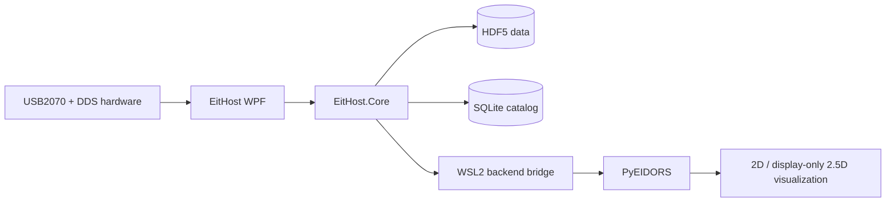

# EitHost

<p align="right">
  <strong>English</strong> | <a href="README.zh-CN.md">简体中文</a>
</p>

<p align="center">
  <strong>Windows workstation for multi-set Electrical Impedance Tomography acquisition, data management, and real-time reconstruction.</strong>
</p>

<p align="center">
  <a href="https://github.com/CBZ199671/EitHost"></a>
  <a href="https://dotnet.microsoft.com/"></a>
  <a href="https://github.com/CBZ199671/EitHost/blob/main/LICENSE"></a>
  <a href="https://github.com/CBZ199671/PyEIDORS"></a>
</p>

EitHost is a Windows desktop application for multi-set Electrical Impedance Tomography (EIT) systems. It coordinates USB2070 data acquisition, DDS excitation, device pairing, HDF5/SQLite data management, real-time demodulation, and signal-quality diagnostics. Through WSL2, it connects to [PyEIDORS](https://github.com/CBZ199671/PyEIDORS) for reconstruction and visualization.

> **Project scope:** EitHost is research and engineering software, not a medical device. Hardware control, synchronization accuracy, and reconstruction results must be independently validated on the target equipment and under the intended experimental conditions.

## Highlights

- **Multi-set orchestration:** Each EIT set consists of one USB2070 acquisition card and one DDS serial controller. EitHost supports manual pairing, single-set operation, and synchronized multi-set startup.
- **Real-time acquisition and demodulation:** Acquisition, demodulation, diagnostics, reconstruction, and UI rendering run as decoupled pipeline stages so slower work does not unnecessarily disturb acquisition cadence.
- **Traceable data lifecycle:** Raw data and derived results are stored in HDF5; experiments and processing state are managed by a SQLite catalog, with CSV export and database replay support.
- **PyEIDORS backend:** A configurable persistent WSL2 worker connects the GUI to PyEIDORS. Solver routes are declared by backend manifests and profiles instead of being hard-coded in EitHost.
- **Visualization and analysis:** Live boundary voltages, reconstruction images, fixed-ROI temporal analysis, and a display-only 2.5D view interpolated from two independently reconstructed 2D layers.
- **Field operations:** Device discovery, driver preflight, runtime logs, evidence export, and Chinese/English UI localization.
- **Ready-to-run package:** A self-contained Windows x64 build is included and does not require a separate .NET Runtime installation.

## Architecture



EitHost owns the Windows-side hardware, experiment workflow, and data lifecycle. PyEIDORS owns finite-element forward and inverse solving. A defined backend configuration and data protocol keep both projects independently evolvable.

## Quick start

### Run the included Windows x64 build

1. Install the USB2070 Windows driver supplied by the hardware vendor.
2. Clone or download this repository.
3. Keep the complete `release/EitHost-Windows-x64` directory together, then run:

```powershell
.\release\EitHost-Windows-x64\EitHost.App.exe
```

Do not copy only the `.exe`. The application requires the configuration and runtime files stored beside it. The repository includes the x64 `USB2070.dll` needed by the GUI, but it does not include the USB2070 kernel-driver package.

See [`release/EitHost-Windows-x64/README.md`](release/EitHost-Windows-x64/README.md) for package usage and SHA-256 verification instructions.

### Build from source

Building from source requires Windows 10/11 x64 and the [.NET 10 SDK](https://dotnet.microsoft.com/download/dotnet/10.0).

```powershell
git clone https://github.com/CBZ199671/EitHost.git
cd EitHost
dotnet restore .\EitHost.slnx
dotnet build .\EitHost.slnx --configuration Release
dotnet run --project .\src\EitHost.App\EitHost.App.csproj --configuration Release
```

## Configure the PyEIDORS backend

Real-time reconstruction is optional and requires WSL2 plus a working PyEIDORS backend. Copy the example configuration:

```powershell
Copy-Item `
  .\src\EitHost.App\eithost.reconstruction.example.json `
  .\src\EitHost.App\eithost.reconstruction.json
```

Set `DistroName`, `BackendRepositoryPath`, and optionally `BackendProfile` for the local environment. Refer to the [PyEIDORS repository](https://github.com/CBZ199671/PyEIDORS) for backend installation, profiles, and worker-interface details.

## Repository layout

| Path | Contents |
|---|---|
| `src/EitHost.App` | .NET 10 / WPF desktop application, workspace ViewModels, and real-time visualization |
| `src/EitHost.Core` | Acquisition, hardware protocols, demodulation, diagnostics, storage, synchronization, and reconstruction bridge |
| `scripts` | USB2070 driver-installation and elevated-launch helpers |
| `release/EitHost-Windows-x64` | Ready-to-run self-contained Windows x64 build and checksums |

## Affiliation, Laboratory, and Funding

| Item | Details |
|---|---|
| Laboratory | 455 Lab |
| Location | Beijing, China |
| Affiliation | College of Information and Electrical Engineering, China Agricultural University |
| Lab Head | Prof. Lan Huang, Prof. Zhong-Yi Wang, and Dr. Lifeng Fan |

455 Lab focuses on plant electrophysiological phenotyping, crop root phenotyping, and crop water-status monitoring. EitHost and PyEIDORS support real-time, in-situ, non-destructive EIT experiments in this research context.

This work was supported by the National Natural Science Foundation of China (Grant No. 62271488).

## License

Original EitHost source code is released under the [MIT License](LICENSE). Vendor runtimes, self-contained .NET components, and NuGet dependencies retain their respective license terms and are not relicensed by the repository's MIT license. See [THIRD_PARTY_NOTICES.md](THIRD_PARTY_NOTICES.md).
