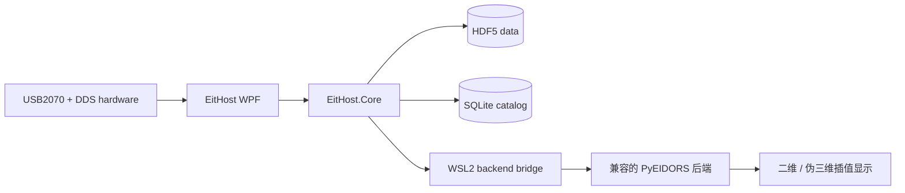

# EitHost

<p align="right">
  <a href="README.md">English</a> | <strong>简体中文</strong>
</p>

<p align="center">
  <strong>面向多套电阻抗成像设备的 Windows 采集、数据管理与实时重构工作站。</strong>
</p>

<p align="center">
  <a href="https://github.com/CBZ199671/EitHost"></a>
  <a href="https://dotnet.microsoft.com/"></a>
  <a href="https://github.com/CBZ199671/EitHost/blob/main/LICENSE"></a>
  <a href="https://github.com/CBZ199671/PyEIDORS"></a>
</p>

EitHost 是面向多套电阻抗成像（EIT）设备的 Windows 桌面上位机。它负责 USB2070 数据采集、DDS 激励控制、设备配对、HDF5/SQLite 数据管理、实时解调与质量诊断；在具备兼容后端时，可通过 WSL2 对接 PyEIDORS 完成重构和可视化。

> **项目定位：** EitHost 是科研与工程实验软件，并非医疗器械。硬件控制、同步精度和重构结果应在目标设备与实验条件下独立验证。

> **后端公开状态：** EitHost 当前对接实验室使用的、尚未公开的 PyEIDORS v2 后端。我们承诺在相关论文撰写完成后开源 PyEIDORS v2。当前公开的 [PyEIDORS 仓库](https://github.com/CBZ199671/PyEIDORS)对应较早的公开版本，不包含本版 EitHost 所需的 worker。

## 主要能力

- **多套设备编排：** 每套设备由一块 USB2070 采集卡和一块 DDS 串口控制板组成，支持手动配对、单套控制与多套同步启动。
- **实时采集与解调：** 采集、解调、诊断、重构和界面渲染采用解耦流水线，降低慢任务对采集节拍的影响。
- **数据可追溯：** 原始数据和派生结果使用 HDF5，实验目录与处理状态使用 SQLite catalog 管理，并支持 CSV 导出与数据库回放。
- **PyEIDORS 集成层：** EitHost 包含可配置的 WSL2 持久 worker 桥接与 manifest/profile 路由；实验室当前使用的兼容 PyEIDORS v2 后端尚未公开。
- **可视化与分析：** 支持实时边界电压、重构图像、固定 ROI 时序分析，以及由两个独立二维逆问题的成像结果沿 z 方向线性插值得到的伪三维视图。
- **现场运维：** 提供设备扫描、驱动预检、运行日志、证据导出和中英文界面。
- **上位机开箱运行：** Windows x64 自包含发布版通过 GitHub Release 附件分发，无需另行安装 .NET Runtime；实时重构仍需兼容的 PyEIDORS 后端。

## 实验录像

上位机在双套分时采集期间录制的伪三维电导率成像。三次实验的背景溶液电导率均为
11.4 µS/cm。

**向水桶中放入亚克力柱与空芯铜圆柱。** 一个是绝缘体、一个是导体，二者相对背景呈相反方向的对比。

https://github.com/user-attachments/assets/0072fac2-f909-4c4d-a9bb-0b766d157e2b

**滴入一滴质量分数 10% 的 KCl 溶液。** 电导率变化从液滴入水点开始扩散。

https://github.com/user-attachments/assets/e7a0cb1d-0687-4dbb-99e2-d1161174b307

**依次滴入质量分数 2%、4%、6%、8%、10% 的 KCl 溶液。** 可比较响应随浓度递增的变化。

https://github.com/user-attachments/assets/3f3ab7dc-5a50-48eb-8475-d1362dc66486

录像同时纳入版本管理，位于 [`media/`](media/)，其中记录了每次实验的配置。伪三维视图由两个
独立二维逆问题的成像结果沿 z 方向线性插值得到，属于显示用途，不等同于真实三维反演，并且保留了
分时方案的层间时间差。图中电导率为相对各次实验已锁定参考的变化量，不是标定后的绝对值。

第一段录像采用 HEVC（H.265）编码，许多浏览器无法播放；可用桌面播放器打开 `media/` 下的副本。
另外两段为 H.264。

## 系统架构



EitHost 负责 Windows 侧硬件、实验流程与数据生命周期；兼容的 PyEIDORS 后端负责有限元正问题和逆问题求解。两者通过明确的后端配置与数据协议连接，便于独立演进。

## PyEIDORS v2 公开状态与开源承诺

PyEIDORS v2 是下一代重大版本，包含大量新增能力、架构改进、扩展的求解流程，以及面向实时 EIT 系统的性能、稳定性和集成能力提升。

由于相关研究论文仍在撰写，PyEIDORS v2 的源代码、worker 实现、后端 manifest 和求解器 profile 目前尚未公开。当前公开的 [PyEIDORS 仓库](https://github.com/CBZ199671/PyEIDORS)对应较早的公开版本，不应视为已经实现当前 EitHost 重构流水线所需的 worker 接口。

**我们郑重承诺：在相关论文撰写完成后，将开源 PyEIDORS v2。** 计划公开的内容包括完整源代码、兼容 EitHost 的 worker 实现、后端 manifest 与 profile、安装文档、可复现实例以及相关验证材料。当前限制只是科研成果发布时序上的阶段性安排，并不意味着 PyEIDORS v2 将长期闭源。

| 组件 | 当前公开状态 |
|---|---|
| EitHost 的采集、设备管理、数据存储、解调、诊断、回放与可视化 | 已包含在本仓库中 |
| EitHost 的 Windows/WSL2 重构集成层 | 已包含在本仓库中 |
| 实验室当前使用的 PyEIDORS v2 重构后端 | 尚未公开；计划在论文撰写完成后发布 |
| 公开环境下完整的端到端实时重构流程 | 在兼容后端发布前暂时无法复现 |

## 快速开始

### 运行已发布的 Windows x64 版本

1. 从硬件厂商提供的安装包安装 USB2070 Windows 驱动。
2. 从 [最新 release](https://github.com/CBZ199671/EitHost/releases/latest) 下载 `EitHost-<版本>-Windows-x64.zip`，或体积更小的 `.7z`。仅运行程序无需克隆本仓库。
3. 将整个 `EitHost-Windows-x64` 文件夹解压到一个可写的固定位置，然后运行：

```powershell
.\EitHost-Windows-x64\EitHost.App.exe
```

不要在压缩包内直接运行，也不要只复制单个 `.exe`。程序需要同目录中的 `HDF.PInvoke.dll`、`HDF.PInvoke.dll.config`、`hdf5.dll`、`hdf5_hl.dll` 和 `USB2070.dll`。启动时会在打开硬件前真实执行一次 HDF5 创建、写入、关闭和删除探针。发布包不含 USB2070 内核驱动安装包。

每个归档内都带有覆盖全部打包文件的 `SHA256SUMS.txt`，每次发布也会公布归档自身的 SHA-256。发布文件的使用方法与校验说明见 [`release/EitHost-Windows-x64/README.md`](release/EitHost-Windows-x64/README.md)。

仓库中的 `release/EitHost-Windows-x64` 保留发布包的随附文件与校验值，但不含可执行文件：自包含 EXE 超过 GitHub 单文件 100 MiB 上限，因此作为 release 附件分发，从源码构建也会生成同一个 EXE。

**本项目统一发布规则：** 每次完成修改并通过相关验证后，运行 `powershell -NoProfile -ExecutionPolicy Bypass -File .\scripts\package-eithost.ps1`，更新唯一运行目录 `release/EitHost-Windows-x64` 并保留现有 `Data`。版本从项目文件读取，不再自动生成分散的日期/版本目录。详见 [发布规则](packaging/RELEASE-RULES.md)。

### 从源码构建

源码构建需要 [.NET 10 官方支持的 Windows x64 版本](https://learn.microsoft.com/en-us/dotnet/core/install/windows)，即仍受支持的 Windows 11，或仍受支持的 Windows 10 Enterprise/LTSC，并需要 [.NET SDK 10.0.301](https://dotnet.microsoft.com/download/dotnet/10.0)或更高的 10.0 feature band。仓库中的 `global.json` 不接受更早的 .NET 10 SDK。

```powershell
git clone https://github.com/CBZ199671/EitHost.git
cd EitHost
dotnet restore .\EitHost.slnx
dotnet build .\EitHost.slnx --configuration Release --no-restore
dotnet run --project .\src\EitHost.App\EitHost.App.csproj --configuration Release --no-build
```

## 配置 PyEIDORS 后端

实时重构是可选功能，需要 WSL2 和兼容的 PyEIDORS v2 后端。目前本节仅适用于已经获得该后端授权访问权限的合作人员；公开的 PyEIDORS 仓库不包含所需的 worker 实现。

EitHost 从 `%LOCALAPPDATA%\EitHost\eithost.reconstruction.json` 读取用户配置。可通过以下命令从示例创建配置：

```powershell
$configDirectory = Join-Path $env:LOCALAPPDATA 'EitHost'
$configPath = Join-Path $configDirectory 'eithost.reconstruction.json'
New-Item -ItemType Directory -Force -Path $configDirectory | Out-Null
Copy-Item `
  .\src\EitHost.App\eithost.reconstruction.example.json `
  $configPath
notepad $configPath
```

然后根据已获授权的本地后端环境设置 `DistroName`、`BackendRepositoryPath` 和可选的 `BackendProfile`。也可以在启动 EitHost 前，将 `EITHOST_RECONSTRUCTION_CONFIG` 设置为其他配置文件的绝对路径。

## 仓库结构

| 路径 | 内容 |
|---|---|
| `src/EitHost.App` | .NET 10 / WPF 桌面应用、工作区 ViewModel 与实时可视化 |
| `src/EitHost.Core` | 采集、硬件协议、解调、诊断、存储、同步与重构桥接 |
| `scripts` | USB2070 驱动安装与管理员启动辅助脚本 |
| `release/EitHost-Windows-x64` | Windows x64 发布包的随附文件、校验值与使用说明；自包含 EXE 作为 release 附件分发 |
| `media` | 本页展示的实验录像，并记录每次实验的配置 |

## 实验室、单位与基金支持

| 项目 | 信息 |
|---|---|
| 实验室 | 455 Lab |
| 地点 | 中国，北京 |
| 单位 | 中国农业大学信息与电气工程学院 |
| 实验室负责人 | 黄岚教授、王忠义教授、范力锋博士 |

455 Lab 聚焦植物电生理表型、作物根系表型与作物水分状态监测。EitHost 和 PyEIDORS 服务于该研究背景下实时、原位、无损的 EIT 实验。

本项目得到国家自然科学基金（项目编号：62271488）支持。

## 许可证

EitHost 原创源码采用 [MIT License](LICENSE)。仓库中的厂商运行库、自包含 .NET 组件和 NuGet 依赖保留各自的许可条款，不因本仓库采用 MIT 而被重新授权；详见 [THIRD_PARTY_NOTICES.md](THIRD_PARTY_NOTICES.md)。

尚未公开的 PyEIDORS v2 后端是独立项目：它不包含在本仓库中，也不受 EitHost 的 MIT 许可证授权。PyEIDORS v2 正式发布时将另行说明其开源许可证。
